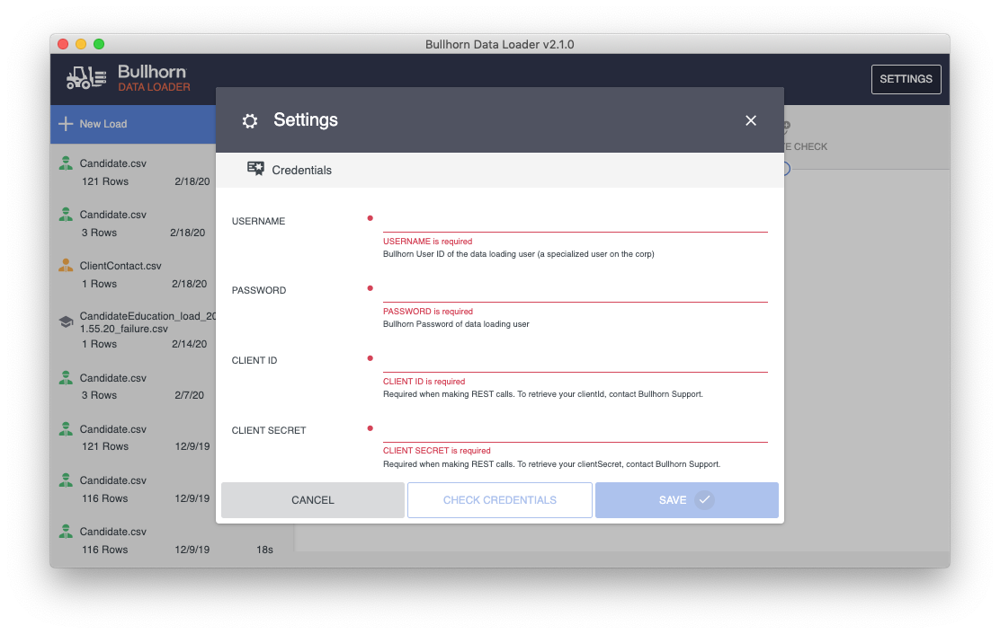
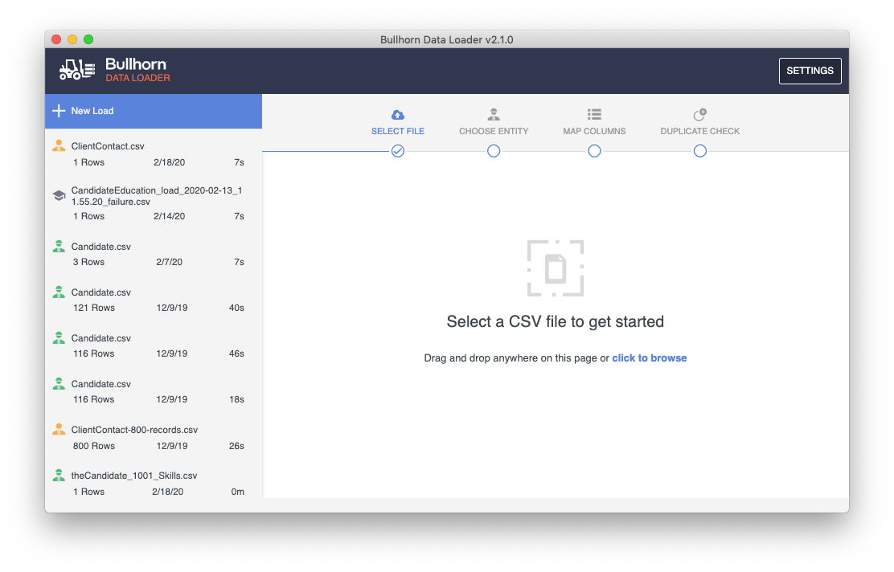
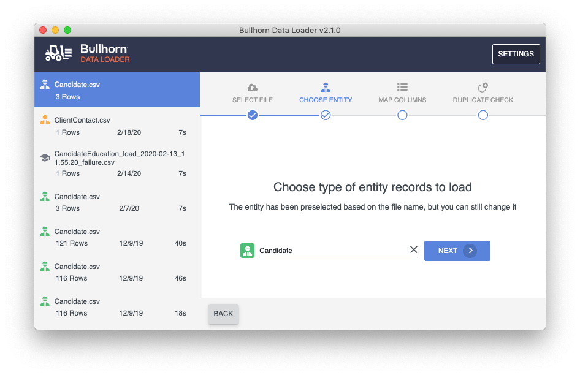
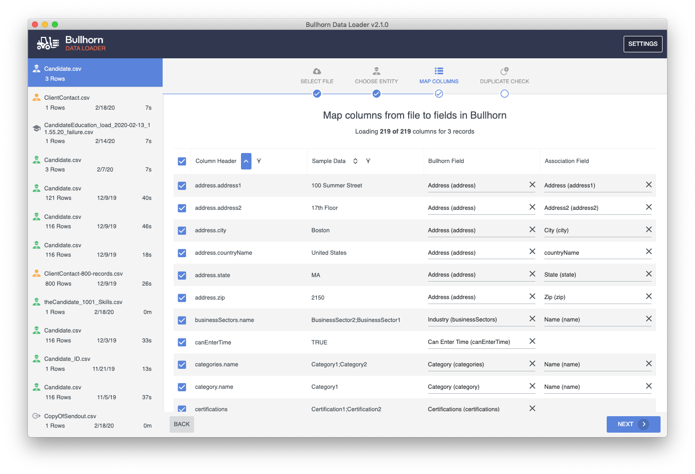
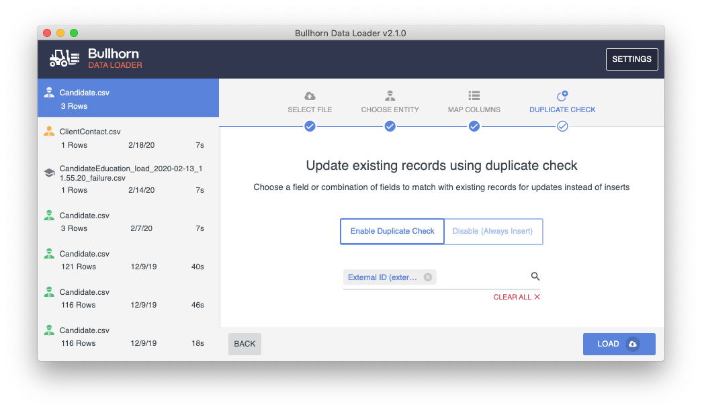
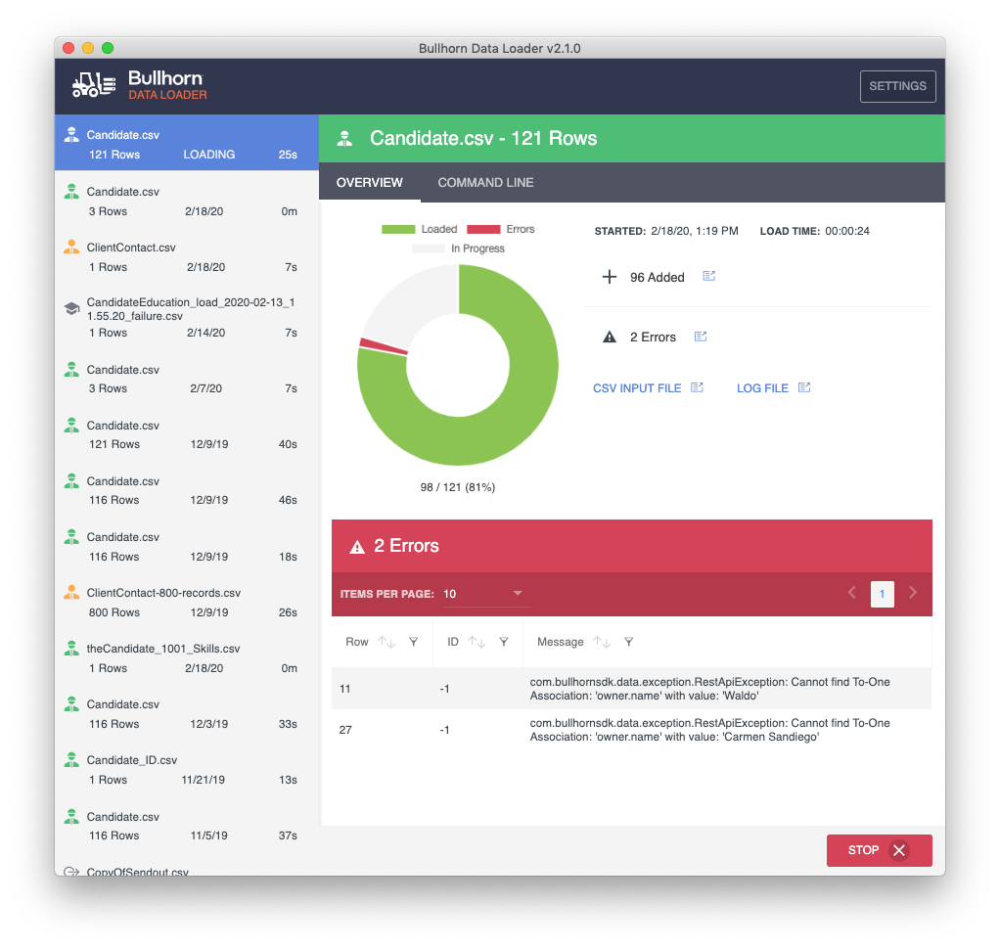

# Bullhorn Data Loader Desktop App

A desktop application for Windows and Mac that wraps the [Bullhorn Data Loader](https://github.com/bullhorn/dataloader) in a convenient, user friendly app. Check out the [Getting Started Video](https://drive.google.com/file/d/1voimdi5vZOj7bmAU-WrGL2ht9C5oP8c1/view).
 
_The app handles loading data only. For features such as exporting and deleting data, parsing and uploading resumes and files, use the [Bullhorn Data Loader](https://github.com/bullhorn/dataloader) on the command line._

## 1. Install the App

Download the latest installer for
[Windows](https://github.com/bullhorn/dataloader-app/releases/download/v2.11.2/Bullhorn-Data-Loader-Setup-2.11.2.exe)
or [Mac](https://github.com/bullhorn/dataloader-app/releases/download/v2.11.2/Bullhorn-Data-Loader-2.11.2.dmg)

## 2. Enter your Credentials

## 3. Select a CSV File

## 4. Choose a Bullhorn Entity

## 5. Map CSV Columns to Fields in Bullhorn

## 6. Enable/Disable Duplicate Check

## 7. View Results Real-Time

